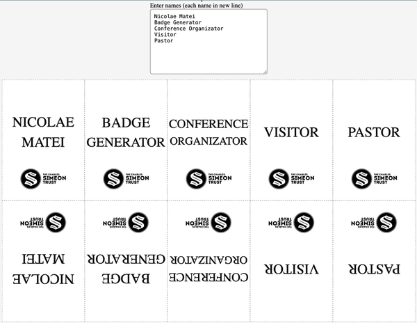
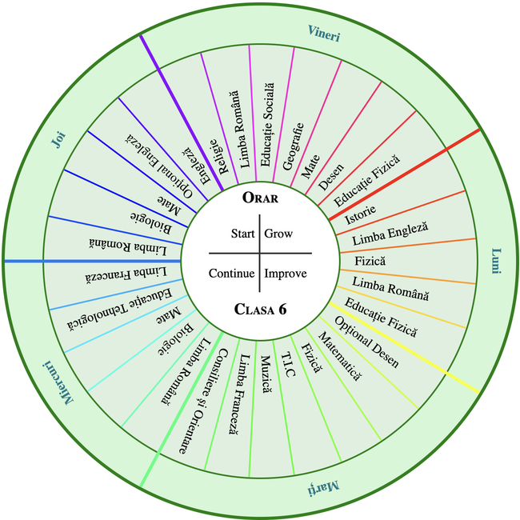
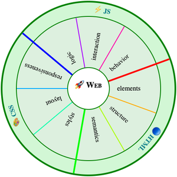
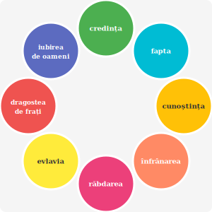

# Generators

Page &amp; elements generators

# Live

## 🪪 [Badges](https://nmatei.github.io/generators/badges)

Enter your **meeting/conference attenders** and generate a badge for each one.


## 🔵 [Circle Slices](https://nmatei.github.io/generators/circle-slices)

Enter your **#groups and items** and generate a nice circle slice for each group. (Examples: groups, school teams + members, title + sub categories, etc.)  


### Include Circle Slices to your page

```html
<div id="groups"></div>

<script src="https://nmatei.github.io/generators/docs/circle-slices.js"></script>

<script>
  const options = CircleSlices.render({
    renderTo: "#groups",
    groupSize: 420,
    slicesSize: 350,
    centerSize: 100,
    default: "logic",
    text: `
# 🔵 HTML
elements
structure
semantics

# 🎨 CSS
styles
layout
responsiveness

# ⚡ JS
logic
interaction
behavior
`,
    centerText: `# 🚀 Web`
  });

  console.info("options", options);

  document.querySelector("#groups").addEventListener("rotate", event => {
    const { angle, slice } = event.detail;
    console.info("rotate %o deg [ %o ]", angle, slice.innerText, slice);
  });
</script>
```



## 🔗 [Virtue Ring](https://nmatei.github.io/generators/virtue-ring)

Generate a **ring of linked colored circles**, each one overlapping the next like a chain. Useful for visualizing ordered sequences, cycles, or virtue chains.



### Include Virtue Ring to your page

```html
<div id="ring"></div>

<script src="https://nmatei.github.io/generators/docs/virtue-ring.js"></script>

<script>
  VirtueRing.render({
    renderTo: "#ring",
    size: 300,
    nodeSize: 80,
    borderWidth: 3,
    fontSize: 10,
    nodes: [
      { label: "credința",       color: "#4CAF50", textColor: "#fff" },
      { label: "fapta",          color: "#00BCD4", textColor: "#fff" },
      { label: "cunoștința",     color: "#FFC107", textColor: "#333" },
      { label: "înfrânarea",     color: "#FF8A65", textColor: "#fff" },
      { label: "răbdarea",       color: "#EC407A", textColor: "#fff" },
      { label: "evlavia",        color: "#FFEB3B", textColor: "#333" },
      { label: "dragostea<br>de frați",  color: "#EF5350", textColor: "#fff" },
      { label: "iubirea<br>de oameni",   color: "#5C6BC0", textColor: "#fff" }
    ]
  });
</script>
```

**Options:**

| Option | Default | Description |
|---|---|---|
| `renderTo` | `"#virtue-ring"` | CSS selector or DOM element |
| `size` | `300` | Overall ring container size (px) |
| `nodeSize` | `80` | Individual circle diameter (px) |
| `borderWidth` | `3` | White border between circles (px) |
| `fontSize` | `10` | Label font size (px) |
| `fontFamily` | `"Georgia, serif"` | Label font family |
| `shadow` | `true` | Drop shadow on circles |
| `nodes` | `[]` | Array of `{ label, color, textColor }` |

A default 8-color palette is exported as `VirtueRing.COLORS` for convenience.

# 📋 Developers TODOs (items to improve)

- [ ] bold/normal config for badge names
