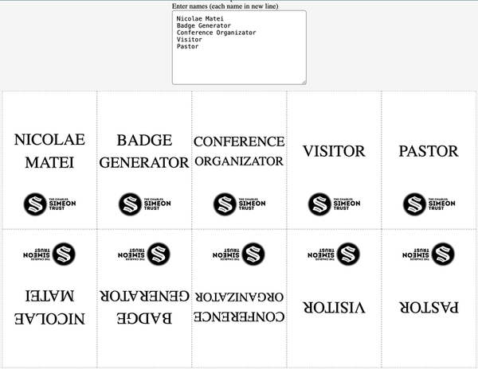
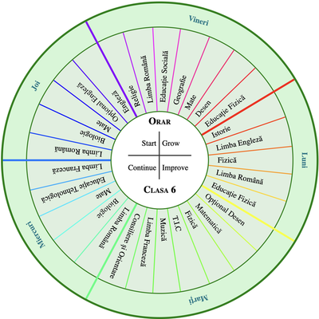

# Generators

Page &amp; elements generators

# Live

## 🪪 [Badges](https://nmatei.github.io/generators/badges)

Enter your **meeting/conference attenders** and generate a badge for each one.


## 🔵 [Circle Slices](https://nmatei.github.io/generators/circle-slices)

Enter your **#groups and items** and generate a nice circle slice for each group. (Examples: groups, school teams + members, title + sub categories, etc.)  


### Include Circle Slices to your page

```html
<div id="groups"></div>

<script src="https://nmatei.github.io/generators/docs/circle-slices.js"></script>

<script>
  const options = CircleSlices.render({
    renderTo: "#groups",
    groupSize: 420,
    slicesSize: 350,
    centerSize: 100,
    default: "logic",
    text: `
# 🔵 HTML
elements
structure
semantics

# 🎨 CSS
styles
layout
responsiveness

# ⚡ JS
logic
interaction
behavior
`,
    centerText: `# 🚀 Web`
  });

  console.info("options", options);

  document.querySelector("#groups").addEventListener("rotate", event => {
    const { angle, slice } = event.detail;
    console.info("rotate %o deg [ %o ]", angle, slice.innerText, slice);
  });
</script>
```


# 📋 Developers TODOs (items to improve)

- [ ] bold/normal config for badge names
